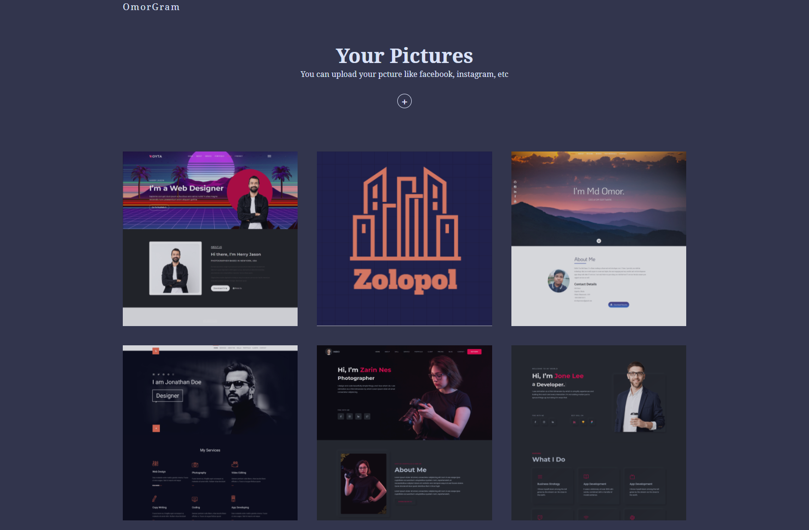

# Photo Gallery App

### A photo Gallery app with firebase backend and React Frontend. You can upload your photo there and It's save in localstorage and firestore.

## Live demo : [Photo Gallery App](https://mdomor.netlify.app/)

## 🚀 Stay connected

<!--  -->
